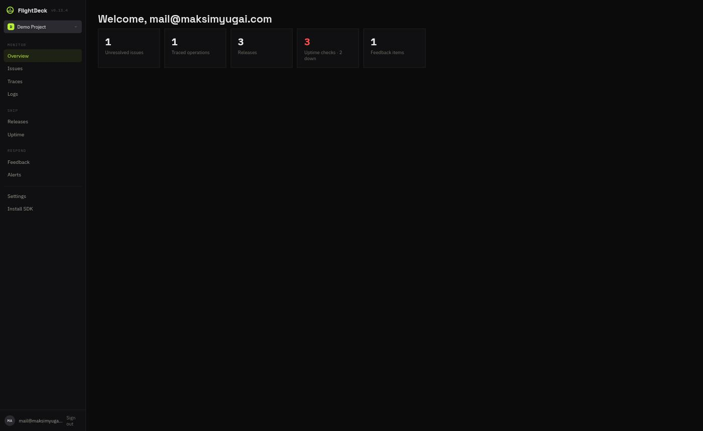
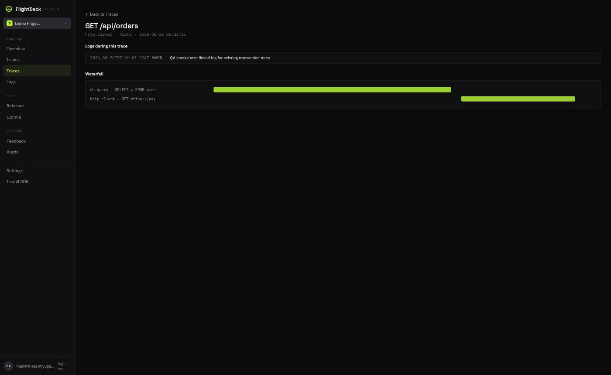

# FlightDeck

[](https://github.com/iumalabs/flightdeck/actions/workflows/ci.yml)
[](https://github.com/iumalabs/flightdeck/actions/workflows/e2e.yml)
[](LICENSE)
[](https://github.com/iumalabs/flightdeck/issues)
[](https://github.com/iumalabs/flightdeck/commits/main)

A Sentry-protocol-compatible observability platform — errors, distributed tracing, structured logs,
releases, uptime monitoring, and user feedback, unified by shared identifiers so an alert, a log
line, and a stack frame are always one click apart. Point an existing Sentry SDK at a new DSN and it
keeps working unmodified.

FlightDeck runs as a single Cloudflare Worker, self-hostable or hosted. Its dashboard sits behind
Cloudflare Access.

> Read [`.specify/memory/constitution.md`](.specify/memory/constitution.md) first — it is the
> authoritative source for the project's principles, architecture, and security requirements. This
> README covers day-to-day setup and operation only.

## Screenshots

| Overview                                                                       | Trace waterfall                                                                    |
| ------------------------------------------------------------------------------ | ---------------------------------------------------------------------------------- |
|  |  |

## Contents

- [Modules](#modules)
- [Authentication](#authentication)
- [Environment](#environment)
- [Local development](#local-development)
- [Deployment](#deployment)
- [Releases](#releases)
- [License](#license)

## Modules

Eight modules are implemented and deployed. Each has its own spec, plan, and task list under
`specs/<NNN-name>/`.

| # | Module                                                              | What it adds                                                                                                                                                                                                                                             |
| - | ------------------------------------------------------------------- | -------------------------------------------------------------------------------------------------------------------------------------------------------------------------------------------------------------------------------------------------------- |
| 1 | [Landing, Access login, app shell](specs/001-landing-access-login/) | The marketing site, Cloudflare Access sign-in, and the authenticated app-shell skeleton.                                                                                                                                                                 |
| 2 | [Error monitoring](specs/002-error-monitoring/)                     | The first public, DSN-authenticated ingest endpoint (Sentry envelope protocol) — issue grouping with source-map-aware fingerprinting, source map upload/resolution, and GitHub App-based suspect commits.                                                |
| 3 | [Distributed tracing](specs/003-distributed-tracing/)               | A `"transaction"` envelope item type, processed asynchronously through a Cloudflare Queue — a visual span waterfall and two-way trace-to-error linking.                                                                                                  |
| 4 | [Structured logs](specs/004-structured-logs/)                       | A `"log"` envelope item type — NDJSON batches in R2, full-text search, a live WebSocket tail, and revocable per-project S3-compatible export.                                                                                                            |
| 5 | [Releases](specs/005-releases/)                                     | A sentry-cli-compatible release-management surface (project-scoped API tokens), release health (adoption/crash-free rate), and regression detection.                                                                                                     |
| 6 | [Uptime monitoring](specs/006-uptime-monitoring/)                   | FlightDeck-original (not Sentry-protocol) HTTP/TCP checks with incident-aware alerting and an optional per-check webhook. Ships **single-region** — Cloudflare Cron Triggers have no controllable execution region, a documented constitution deviation. |
| 7 | [User feedback](specs/007-user-feedback/)                           | A `"feedback"` envelope item type plus a real `showReportDialog()`-compatible crash-report dialog, both cross-linked to the originating issue.                                                                                                           |
| 8 | [Multi-project support](specs/008-multi-project-support/)           | A post-hoc module: real per-project DSNs and a shared `resolveRequestedProject()` helper, reused by every pillar module to scope the dashboard to a `?project=` query parameter.                                                                         |

See [Deployment](#deployment) for the one-time Cloudflare-dashboard steps a fresh environment needs
before `release` builds go live.

## Authentication

FlightDeck implements no identity provider of its own — Cloudflare Access fronts a single bounce
path, `/login`. It verifies the `Cf-Access-Jwt-Assertion` header Access injects there, then mints
FlightDeck's own signed `fd_session` cookie, which every other control-plane request
(`/api/internal/*`) is checked against. Both steps fail closed on any verification error.

The ingest endpoint (`/api/{project_id}/envelope`) is public by design, authenticated by each
project's DSN key instead — see the constitution for the full trust-surface split.

Module 5 adds a third credential form — project-scoped API tokens (`Authorization: Bearer <token>`)
for the sentry-cli-compatible release-management surface (`/api/0/...`). It's not a third trust
surface: a token is generated by an authenticated human via the dashboard and carries the same
control-plane authorization as a session cookie, just in a form a non-browser CI/CD client can hold.
A DSN key can never manage releases, and an API token can never submit anonymous SDK events. Tokens
are hashed (HMAC with a server-side pepper); the raw value is shown once, at generation time, and
never again.

**Required manual post-deploy step**: Preview URLs default to public. Restrict them via **Workers &
Pages → flightdeck → Access tab → Protect this Worker behind Access**, scope set to **Previews
only** — not "All traffic", which would also gate the public marketing site.

## Environment

| Variable                    | Secret? | Purpose                                                                                                |
| --------------------------- | :-----: | ------------------------------------------------------------------------------------------------------ |
| `TEAM_DOMAIN`               |         | Cloudflare Access team domain — enables JWT verification.                                              |
| `POLICY_AUD`                |         | Expected audience claim of `Cf-Access-Jwt-Assertion`.                                                  |
| `CF_ACCOUNT_ID`             |         | Cloudflare account id.                                                                                 |
| `SESSION_SECRET`            |   ✅    | HMAC key `/login` signs the `fd_session` cookie with.                                                  |
| `GITHUB_APP_ID`             |         | GitHub App used for suspect-commit lookups (Module 2).                                                 |
| `GITHUB_APP_PRIVATE_KEY`    |   ✅    | Signs short-lived GitHub App JWTs on demand.                                                           |
| `CLOUDFLARE_R2_ADMIN_TOKEN` |   ✅    | Provisions per-project R2 export credentials (Module 4). Not required for log ingest/search/live-tail. |
| `API_TOKEN_PEPPER`          |   ✅    | HMAC key Module 5 signs API tokens with.                                                               |

Every secret is set via `wrangler versions secret put <NAME>` (no `--env` flag — see the comment in
`wrangler.jsonc`), never as a plain `var`. Copy `.dev.vars.example` to `.dev.vars` (gitignored) for
local `deno task dev`.

**Known dev-mode quirk**: `deno task dev` (plain Vite, for HMR) doesn't apply SPA fallback on a hard
reload of a nested path (e.g. reloading directly at `/docs` 404s). Navigate via in-app links during
`deno task dev`, or use `deno task build && deno run -A npm:wrangler dev --env preview` (what the
e2e suite runs) to test deep links locally.

## Local development

```sh
deno install
deno task db:migrations:apply:local
deno task dev
```

```sh
deno task test        # unit tests
deno task test:e2e     # Playwright e2e (excludes the real Cloudflare Access IdP challenge)
deno task fmt
deno task lint
deno task build
```

See [`specs/001-landing-access-login/quickstart.md`](specs/001-landing-access-login/quickstart.md)
for scenario-by-scenario validation steps.

## Deployment

Deployment uses the native Cloudflare → GitHub integration (Workers Builds) — GitHub Actions only
runs `fmt`/`lint`/`typecheck`/unit-test/build as PR gates. The production branch is `release`, which
`release-please` fast-forwards on every release (see `.github/workflows/release-please.yml`).

**One-time setup, in order:**

1. **Connect the repo.** Cloudflare dashboard → **Workers & Pages → Create → Import a repository** →
   `iumalabs/flightdeck`. Set the production branch to `release`, not `main`.

   | Field                              | Value                                                                         |
   | ---------------------------------- | ----------------------------------------------------------------------------- |
   | Build command                      | `npx -y deno task build`                                                      |
   | Deploy command                     | `npx -y deno task deploy:production`                                          |
   | Builds for non-production branches | **disabled** — see note below                                                 |
   | Protect with Cloudflare Access     | **leave disabled** — see [Authentication](#authentication)'s post-deploy step |

   `workers_dev` stays `false` from the first commit onward (constitution Principle I — never relax
   this).

2. **Provision the two Queues** (Modules 3-4 — can't be scripted via Workers Builds config):
   ```sh
   wrangler queues create flightdeck-production-trace-ingest
   wrangler queues create flightdeck-production-trace-ingest-dlq
   wrangler queues create flightdeck-production-log-ingest
   wrangler queues create flightdeck-production-log-ingest-dlq
   ```
   Repeat with `-preview-` in place of `-production-` for the preview environment.

3. **Provision the R2 bucket** (Module 4):
   ```sh
   wrangler r2 bucket create flightdeck-production-logs
   wrangler r2 bucket create flightdeck-preview-logs
   ```
   Per-project export buckets are provisioned dynamically at runtime — nothing to create ahead of
   time for those.

4. **Add a `CLOUDFLARE_API_TOKEN` repository secret** (Account → D1 Edit scope), via **Settings →
   Secrets and variables → Actions**. `.github/workflows/d1-migrations.yml` uses it to run
   `wrangler d1 migrations apply --remote` against both databases on every push to `main` that
   touches `worker/db/migrations/**` — Workers Builds never applies migrations on its own. Without
   this secret, new migrations land in the SQL files but never reach the real databases.

**Why "Builds for non-production branches" stays off:** work on this repo routinely spans many
short-lived, throwaway branches at once. If enabled, every push to any of them would trigger a real
build+deploy to the single shared `flightdeck-preview` Worker, so whichever branch pushed last would
silently clobber whatever anyone else was previewing. `deno task deploy:preview` still works fine
run by hand — it's just not wired to fire automatically.

## Releases

Versioning follows `release-please` against the root `VERSION` file (`"simple"` release type).
Release-please branch names stay short (`release`, not a per-component prefixed name) to match the
Workers Builds production-branch configuration above.

## License

[AGPL-3.0](LICENSE).
